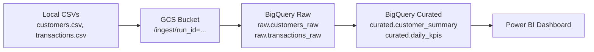

# Customer Transactions ETL Pipeline
**Local → GCS → BigQuery (Raw) → BigQuery (Curated) → Power BI**

A simple, end-to-end batch ETL pipeline that ingests **customer** and **transaction** CSV files, loads them into **Google Cloud Storage**, ingests into **BigQuery (raw layer)**, then builds **curated analytics tables** using SQL for **Power BI reporting**.

---

## What this project demonstrates
- Batch ETL / ELT workflow
- Cloud storage ingestion (GCS)
- BigQuery loading (raw tables)
- SQL transformations (curated tables)
- Simple analytical modelling (customer + daily KPI views)
- BI consumption using Power BI

---

## Architecture




---

## Repository Structure

```
customer-etl/
│
├── data/
│ ├── customers.csv
│ └── transactions.csv
│
├── sql/
│ ├── 02_transform_customer_summary.sql
│ └── 03_transform_daily_kpis.sql
│
├── src/
│ ├── config.py
│ ├── gcs_upload.py
│ ├── bq_load_raw.py
│ ├── bq_run_sql.py
│ ├── run_pipeline.py
│ └── data_separation.py # optional (if starting from single dataset)
│
├── requirements.txt
└── README.md
```
---

## Inputs

`data/customers.csv`

Customer master data (identity + signup info).

data/transactions.csv

Transaction-level events (timestamp, amount, merchant/category fields).

Replace the sample CSVs with your own as long as the column names match the schema expected by src/bq_load_raw.py.

---

## Outputs (BigQuery curated dataset)

`curated.customer_summary`

Customer-level aggregates:

`txn_count`

`total_spend`

`avg_txn_value`

`first_txn_ts`, `last_txn_ts`

`activity_status` (`NO_TXNS`, `ACTIVE_30D`, `INACTIVE`)

`curated.daily_kpis`

Daily KPIs:

`txn_count`

`active_customers`

`revenue`

`avg_order_value`

---

## Prerequisites

- Python 3.9+ (3.10/3.11 recommended)

- A GCP project with:
    - GCS bucket (example: `gs://your-customer-etl-bucket/`)
    - BigQuery datasets:
        - `raw`
        - `curated`

- Service account with permissions:
    - Storage Object Admin (or Object Creator + Viewer)
    - BigQuery Job User
    - BigQuery Data Editor (on the datasets)
---

## Setup

1) Authenticate (Service Account Key)

Windows (PowerShell)
```
setx GOOGLE_APPLICATION_CREDENTIALS "C:\path\sa-key.json"
```

macOS / Linux
```
export GOOGLE_APPLICATION_CREDENTIALS="/path/to/sa-key.json"
```

2) Install dependencies
```
pip install -r requirements.txt
```

3) Set environment variables

Windows (PowerShell)
```
$env:GCP_PROJECT_ID="your-gcp-project-id"
$env:GCS_BUCKET="your-customer-etl-bucket"
$env:BQ_RAW_DATASET="raw"
$env:BQ_CURATED_DATASET="curated"
```

macOS / Linux
```
export GCP_PROJECT_ID="your-gcp-project-id"
export GCS_BUCKET="your-customer-etl-bucket"
export BQ_RAW_DATASET="raw"
export BQ_CURATED_DATASET="curated"
```
---

## Run the pipeline

From the repo root:
```
python -m src.run_pipeline
```

### What happens when you run it:

1. Uploads `data/customers.csv` and `data/transactions.csv` to GCS under a timestamped `run_id=...` folder

2. Loads them into BigQuery raw tables:
    - `raw.customers_raw`
    - `raw.transactions_raw`

3. Executes SQL transformations to create/replace curated tables:
    - `curated.customer_summary`
    - `curated.daily_kpis`

---

## Power BI (reporting)

1. Open Power BI Desktop
2. Get Data → Google BigQuery
3. Sign in and select dataset: `curated`
4. Load:
    -`customer_summary`
    -`daily_kpis`

Suggested visuals:
    - Line chart: Revenue by txn_date (from `daily_kpis`)
    - KPI cards: revenue, txn_count, active_customers
    - Table: customer spend + txn_count with slicers for `country` and `activity_status`

---

## Troubleshooting

- 403 / Access Denied: service account missing BigQuery or Storage permissions.
- Not found: Dataset: create BigQuery datasets raw and curated first.
- python not recognized on Windows: Python isn’t installed or not added to PATH (install from python.org and tick “Add to PATH”).


